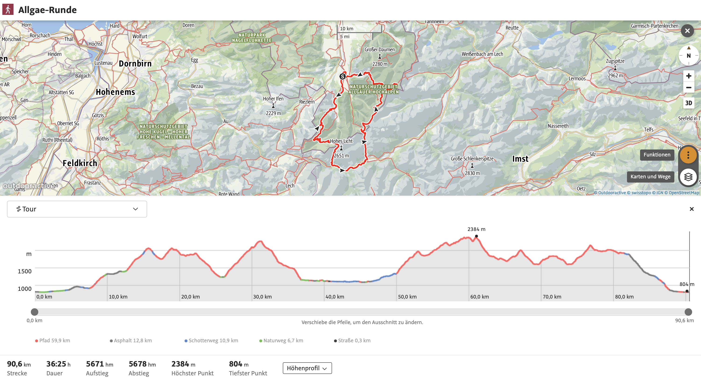

What:
Allgaeu crossing, which might feel like from the shire to Mordor
- distance: ~ 90 km
- 5500hm 🔼🔽

When:
August 2024
11th Sun to 17th Sat

Where:
from Obertsdorf to Oberstdorf

### pre-requisites

#### condition
- up to ~ 9.5 day-tour incl. breaks

#### equipment
- container for ~ 2 Liters of water (we might have some chances on the way to re-fill)
- backpack for a day (~ 30L)
- some snacks/bars/dates/nuts/sandwiches (could buy on the huts for the days, as well)
- hiking boots
- isolation jacket
- zipper pants
- rain jacket
- rain-proof pants
- 2 T shirts
- 1 long sleeve
- 1 sweatshirt
- food-box
- medicine / first aid kit
- sleeping bag for the huts (not one for low temperatures ⚠️) https://alpenverein.shop/huettenschlafsack-biobaumwolle-1337-15026
- shoes for the huts (not obligatory)
- ear plugs
- some eye-cover/buff/bandana (https://external-content.duckduckgo.com/iu/?u=https%3A%2F%2Ftse3.mm.bing.net%2Fth%3Fid%3DOIP.OC7lC23ktoZtEeFQRKOAZQHaE8%26pid%3DApi&f=1&ipt=7322496692b7ec3628492f80479d9a853c1c582f3f70b2a606de5ef53405652c&ipo=images)
- hiking sticks
- cash 💰💰💰 approximately 80 per day ~ 400 € for the week
	- warm showers most of the time with coins only (if even)
	- sometimes buying drinking water required
- DAV membership ~ 80€ per year, saves 60€ accomodation costs + travel insurance is included, hut sleeping bag
- additional travel-insurance?
- sun glasses
- hat
- small garbage bags
- sun screen

|        |                 |             |                    |            |                     |                     |                                    |                    |                              |                                                  |
| ------ | --------------- | ----------- | ------------------ | ---------- | ------------------- | ------------------- | ---------------------------------- | ------------------ | ---------------------------- | ------------------------------------------------ |
| Etappe | Datum           | Laenge [km] | hm [m] hoch/runter | Laenge [h] | Start               | Ziel                | Telefonnummer/Kontakt - Zielhuette | Preis - Zielhuette | vegan angefragt              | Link                                             |
| 1      | 12. August 2024 | 15          | 1309/0             | 6          | Oberstdorf          | Fiderepass-Huette   | 0043 664 3203676                   | 80                 | ✅ steht auf der Website      | https://www.alpenvereinaktiv.com/de/r/286951691/ |
| 2      | 13. August 2024 | 14.4        | 1200/1200          | 7          | Fiderepass-Huette   | Rappensee-Huette    | kontakt@rappenseehuette.de         | 80                 | ✅ steht auf der Website      | https://www.alpenvereinaktiv.com/de/r/286951739/ |
| 3      | 14. August 2024 | 23.4        | 1066/1308          | 8.25       | Rappensee-Huette    | Kemptner Huette     | 0049 8322 700152                   | 80                 | angefragt                    | https://www.alpenvereinaktiv.com/de/r/286951786/ |
| 4      | 15. August 2024 | 18          | 1400/1400          | 8          | Kemptner Huette     | Prinz-Luitpold-Haus | info@prinz-luitpoldhaus.de         | 80                 | keine Anfrage vorab moeglich | https://www.alpenvereinaktiv.com/de/r/286951834/ |
| 5      | 16. August 2024 | 10          | 600/600            | 5          | Prinz-Luitpold-Haus | Edmund-Probst-Haus  | 08322 4795                         | 80                 | ✅ telefonisch angefragt      | https://www.alpenvereinaktiv.com/de/r/286951883/ |
| 6      | 17. August 2024 | 7.7         | 0/1200             | 3          | Edmund-Probst-Haus  | Oberstdorf          |                                    |                    |                              | https://www.alpenvereinaktiv.com/de/r/286951908/ |

## 6 Stages

### 1 Monday 12.08. - Oberstdorf - Fiderepass-Huette

- start at Hostel Ron's Guesthouse
	- Ludwigstraße 5, 87561 Oberstdorf
- 2 four bed rooms, one with own bathroom, one with community bathroom
- 365,60€ / 8 = 45,70€ (without cost cancellable until 27.7.24)
- arrival until 16 - 20 o'clock possible

### 2 Tuesday 13.08. - Fiderepass-Huette - Rappenseehuette

### 3 Wednesday 14.08. - Rappenseehuette - Kemptnerhuette

### 4 Thursday 15.08. - Kemptnerhuette - Prinz Luitpold Huette

### 5 Friday 16.08. - Prinz Luitpold Huette - Edmund-Probst Haus

### 6 Saturday 17.08. - Edmund-Probst Haus - Oberstdorf
