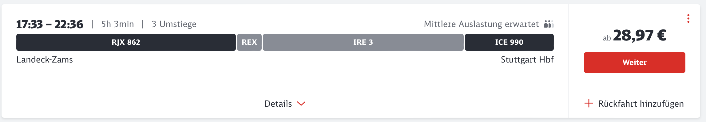

What:
High altitude tour to the Weißseespitze (3510m)

When:
September 2024
28th Sat to 29th Sun

Where:
Kaunertal (Rauhekopfhuette)

## arrival (from Stuttgart) by 🚝 and 🚌
		- ride to Landeck
			- Saturday 
		- continue by bus to [Feichten](https://www.kaunertal.com/de/Ihr-Kaunertal/Orte-Sehenswuerdigkeiten/Kaunertal-Feichten) at the [Kaunertal](https://www.kaunertal.com/de) up to the climbing area Fernegries, direct at the tollway
			- connections ~ 1.5h 
	- **ascent**: from the bus stop Fernegries to Fernegarten passing Gepatschgletscher
	- ascent from Gepatschhaus
		- https://www.alpenvereinaktiv.com/s/ZpEr4
		- 5,9 km
		- 887 hm
		- ~ 3h
	- departure
		
- Weißseespitze - Tour:
  https://www.alpenvereinaktiv.com/s/IVpmMa

### pre-requisites

#### condition
- up to ~ 9.5 day-tour incl. breaks

#### equipment
- medicine / first aid kit
- sleeping bag for the huts
- ear plugs

